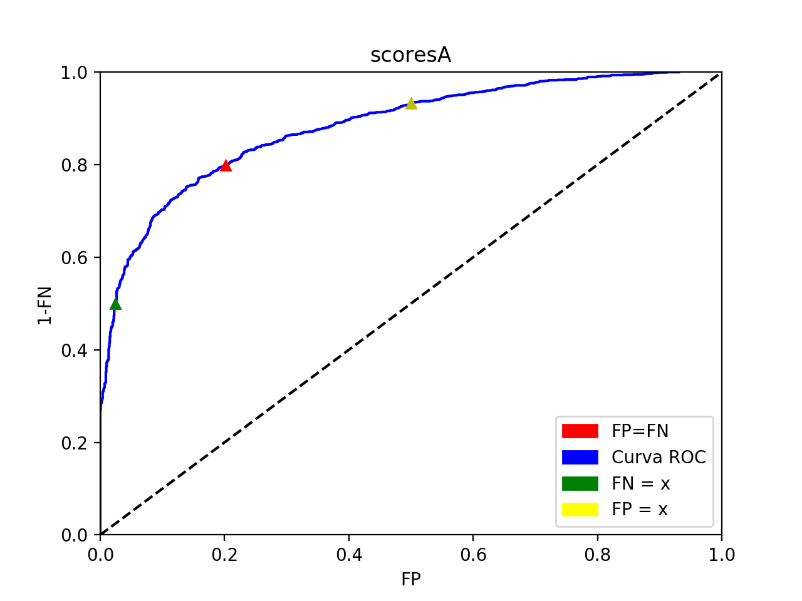
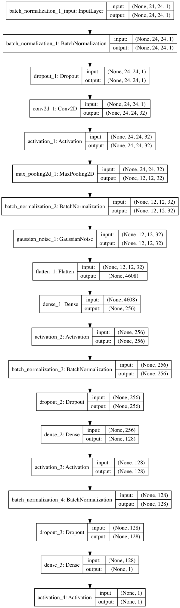
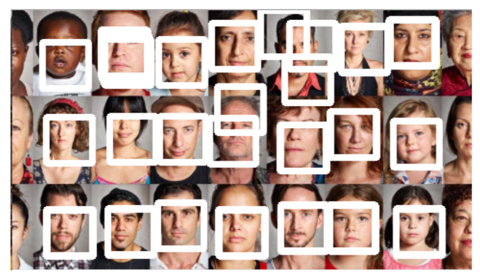

# Biometría
Practicas desarrolladas para la asignatura Biometría del Master IARFID de la UPV.

##Practica 1 (Curva ROC):

Se propone como ejercicio de práctica de la asiginatura Biometría del Master en inteligencia artificial reconocimiento de formas e imágenes digital, realizar un programa que dado dos ficheros: scores clientes y scores impostores obtenga:
* Curva ROC

* FP(FN = X) y umbral
* FN(FP = X) y umbral
* FP=FNyumbral
* Area bajo la curva ROC
* D-Prime



Para ejecutarse se deben tener dos archivos en la carpeta data en la raiz del directorio con el siguiente formato x_clientes y x_impostores, el script se ejecuta asi:
```
python scripts/curvaROC.py
```
**Python code**: [here](scripts/curvaROC.py)
**Report**: [here](resources/Practica%20Curva%20ROC.pdf)

----

##Practica 2 (Detector de Rostros):

Se propone como ejercicio de práctica de la asignatura Biometría del Master en inteligencia artificial reconocimiento de formas e imágenes digital, implementar un NN-Based Face Detection. Se dispone de una base de datos con caras y no-caras a tamaño fijo (24x24), entregada por el docente. Adicionalmente se extiende la base de datos para obtener una mejor generalización del modelo.

Para el entrenamiento del modelo se realizo un división de train y validation del 80/20 porciento de los datos. El set de datos de entrenamiento quedo con un total de 385.028 y el de validación con un total de 96.258.



Para la ejecución del programa se necesitan de dos parámetros uno obligatorio y el segundo opcional, el primero hace referencia la ruta donde se encuentra la imagen a analizar y el segundo permite probar diferentes pixeles de recorrido de ventana.

```
python scripts/facedetection.py -i data/test5.jpg -p 1
```



**Python code for detection**: [here](scripts/facedetection.py)
**Python code for train model**: [here](scripts/deteccion_model_C.py)
**Report**: [here](resources/Deteccion%20de%20rostros.pdf)

---

## Built With

* [Keras](https://github.com/keras-team/keras) - Frontend for Deeplearning
* [TensorFlow](https://github.com/tensorflow/tensorflow) - Bakend for Deeplearning
* [Sklearn](http://scikit-learn.org/stable/) - Machine Learning Process
* [Pandas](https://pandas.pydata.org) - Data structures and data 

## Authors

* **Sebastian Correa Echeverri** [gitlab](https://gitlab.com/scorrea92) [github](https://github.com/scorrea92)

